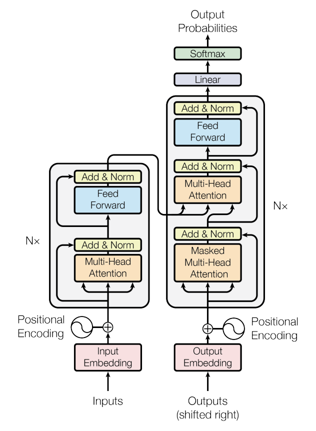

## GPT implementation in PyTorch

This is a PyTorch implementation of the original transformer paper, [Attention Is All You Need (Vaswani et al., 2017)](https://arxiv.org/abs/1706.03762), based on the architecture below, trained on the TinyShakespeare dataset.

This implementation, contained within `gpt.py`, follows the architecture described in the paper and includes all core components of the transformer model.

### Features

- Complete transformer architecture implementation
- Multi-head attention mechanism
- Positional encoding
- Feed-forward networks
- Layer normalization
- Dropout regularization
- Training script with TinyShakespeare dataset
- Example usage and visualization
